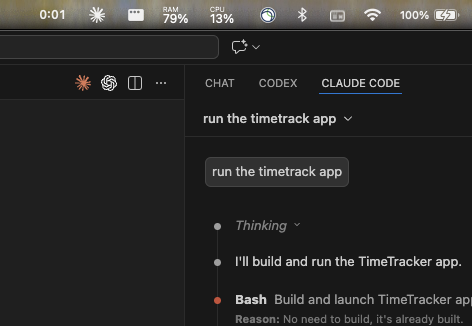
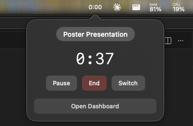
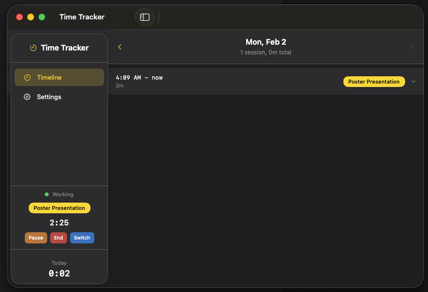
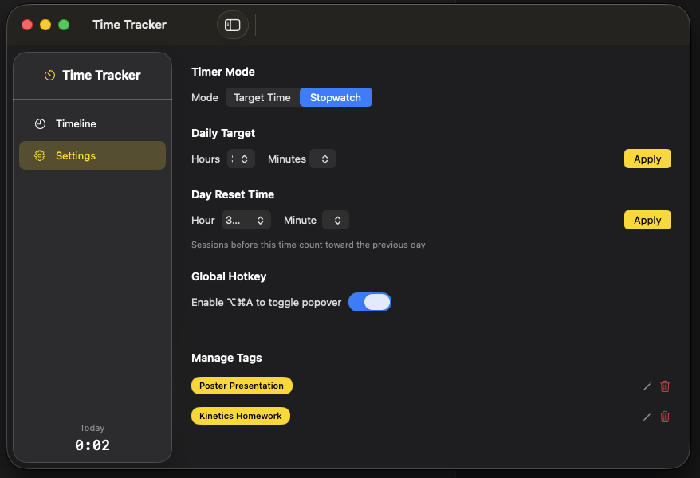

# TimeTrack: A fun vibe coded nenu bar time accountability app
(Work in progress, current iterations only been vibe coded. I intend to learn more swift and understand the codebase better to find out bugs. Feel free to do that, if you like how the app looks!)

I made this because I have severe executive dysfunction, and I will do literally anything except work. Like make an app. * cough cough * 

Basically a minimal, native macOS menu bar app for time accountability. Track work sessions in the menu bar (the ribbon at the top), store everything locally, and keep a clean record of tasks done, with daily target goals and stuff. 

Note that this is not at To-Do app. That's kinda uncool now. This is an app to keep accountability for what work you have done, because when you _track_ stuff, you _do_ stuff.

### A few images of the app:
1. How the App looks from the menu bar: Just a timer. 


2. Clicking the timer opens a popover:


3. The Dashboard. The timeline shows the list of things you have worked on. 


4. Settings. It can run in 2 modes - a daily timer with a specified goal time for work, or a stopwatch to track how long you worked on and on what. 


I'm considering adding more things, like a calendar-like lookup on what you worked on, some data analytics, a more complex goal time measurer. 

---

## 1) Product Goal

Create a native macOS app that helps you remain accountable about what you work on, without interruptions.

Core philosophy:
- **Tag first, work continuously**: Select what you're working on, then let the timer run
- **Local-first privacy**: All data remains on-device
- **Minimal friction**: Start tracking in one click, add notes later if needed
- **Native macOS feel**: Menu bar presence, clean popover, proper main window
- **Minimal overhead**: Does not hog RAM

---

## 2) Two Timer Modes

### 2.1 Target Time Mode (Default)
- Menu bar shows **time remaining** toward your daily goal (default: 3 hours)
- Counts down: `2:45` → `2:44` → ... → `0:00`
- At goal: Shows **✓** checkmark, then counts overtime as `+0:15`, `+0:30`, etc.
- Resets daily at **3:00 AM** (configurable) to account for late-night work

### 2.2 Stopwatch Mode
- Menu bar shows **total time worked today**
- Counts up from `0:00` → `0:01` → ...
- Simple tracking without a target

Display note: Use monospaced digits for stable rendering in menu bar.

---

## 3) UI Structure

### 3.1 Menu Bar Item
- Displays time in `H:MM` format
- Click to open popover
- Right-click for quick menu: Open Dashboard, Settings, Quit

### 3.2 Popover (Minimal)
The popover is intentionally minimal. Click the menu bar timer to open.

**When idle (no timer running):**
- Tag selector: recent tags as clickable chips + autocomplete text field
- Selecting/entering a tag immediately starts the timer
- "Open Dashboard" link

**When timer running:**
- Current session tag (as pill)
- Current session elapsed time
- Three action buttons:
  - **Pause Timer** – pauses clock, same session continues when resumed
  - **End Task** – saves session, opens main window for optional notes
  - **Switch Task** – saves session, opens main window, prompts for new tag
- "Open Dashboard" link

**When paused:**
- "Paused" indicator with current tag
- Resume button
- End Task / Switch Task buttons

### 3.3 Main Window (Dashboard)
A proper window for timeline, editing, and settings. Opened from popover or hotkey.

**Contents:**
- **Header**: Date display, day navigation arrows (← →), daily summary stats
- **Timeline**: Chronological list of today's sessions
- **Settings**: Accessed via tab or sidebar

---

## 4) Core Workflow

1. **Start**: Open popover → select tag (chips or type with autocomplete) → timer starts
2. **Work**: Timer runs continuously in background
3. **Pause** (optional): Click Pause to temporarily stop the clock; Resume to continue same session
4. **End/Switch**:
   - **End Task**: Session saved, main window opens for optional notes
   - **Switch Task**: Session saved, main window opens, select new tag to continue

All sessions are logged immediately with their tag. Description and remarks can be added later from the timeline.

---

## 5) Session Fields

Each session can have:

| Field | Limit | Required | Notes |
|-------|-------|----------|-------|
| **Tag** | ≤30 chars | Yes | Short label for the workstream |
| **Description** | ≤140 chars | No | Brief summary of work done |
| **Remarks** | Unlimited | No | Long-form notes, code snippets, follow-ups |

The speed path is: select tag → work → done. Add details only if you want to.

---

## 6) Tag System

### 6.1 Tag Selection
- Recent tags displayed as clickable chips (last 10 used)
- Autocomplete text field for searching/creating tags
- Type a new name and press Enter to create inline

### 6.2 Tag Management (in Settings)
- Rename tags
- Delete unused tags
- Reorder tags (affects chip display order)

---

## 7) Timeline (Main Window)

### 7.1 Timeline Entries
Chronological list of sessions for the selected day. Each entry shows:
- Time range (start–end)
- Duration badge (e.g., "1h 25m")
- Tag as colored pill

### 7.2 Session Details
Click a session to expand inline:
- View/edit tag, description, remarks
- Save changes or cancel

### 7.3 Day Navigation
- Left/right arrows to browse previous/next days
- Date label shows selected day (e.g., "Tue, Jan 13")
- Header shows: "4 sessions, 3h 42m total"

---

## 8) Settings

Accessible from main window. Keep minimal:

| Setting | Options | Default |
|---------|---------|---------|
| Timer Mode | Target Time / Stopwatch | Target Time |
| Daily Target | Duration picker | 3 hours |
| Day Reset Time | Time picker | 3:00 AM |
| Global Hotkey (⌥⌘A) | Enable / Disable | Enabled |

Additional in Settings:
- **Manage Tags**: Rename, delete, reorder tags

---

## 9) Keyboard Shortcuts

| Shortcut | Action |
|----------|--------|
| ⌥⌘A | Toggle popover |
| ⌥⌘P | Pause/Resume timer (without opening UI) |

Hotkeys can be disabled in Settings.

---

## 10) Storage

### 10.1 Location
All data stored under:
`~/Library/Application Support/TimeTracker/`

Structure:
```
Sessions/
  2024-01-13.yaml
  2024-01-14.yaml
  ...
settings.yaml
tags.yaml
```

### 10.2 Session Schema (YAML)
```yaml
- id: "uuid-here"
  start: "2024-01-13T09:30:00Z"
  end: "2024-01-13T11:15:00Z"
  duration_seconds: 6300
  tag: "Deep Work"
  description: "Refactored auth module"
  remarks: |
    Notes here, can be multiline.
    Include code snippets if needed.
  created_at: "2024-01-13T11:15:00Z"
  updated_at: "2024-01-13T11:20:00Z"
```

### 10.3 Data Integrity
- **Atomic writes**: Write to temp file, then replace
- **Backups**: Maintain `.bak` file for each day's data

---

## 11) Visual Design

- **Theme**: Dark mode (dark gray/charcoal backgrounds)
- **Accent Color**: Gold (#FFD700)
  - Active states and selections
  - Progress ring fill (Target mode)
  - ✓ checkmark when target reached
  - Interactive element highlights
- **Typography**: System font, monospaced digits for timers

---

## 12) Tech Stack

- **Swift** (core language)
- **SwiftUI** (UI views)
- **AppKit bridging** for:
  - `NSStatusItem` (menu bar)
  - `NSPopover` (popover)
  - `NSWindow` (main window)
- **Carbon/HotKey API** for global hotkeys
- **Yams** or similar for YAML serialization

---

## 13) MVP Build Order

1. Menu bar status item with timer display
2. Popover: tag selection → start timer
3. Popover: pause/end/switch actions
4. Main window: timeline view
5. YAML storage with atomic writes
6. Session editing in timeline
7. Day navigation
8. Settings UI
9. Hotkey ⌥⌘A to toggle popover
10. 3 AM day reset logic
11. Target mode ✓ indicator and overtime display

---

## 14) Definition of Done (MVP)

- [ ] Menu bar shows time in selected mode
- [ ] Clicking menu bar opens minimal popover
- [ ] Can select tag to start timer
- [ ] Pause/Resume works within same session
- [ ] End Task saves session and opens main window
- [ ] Switch Task saves and prompts for new tag
- [ ] Main window shows today's timeline
- [ ] Can navigate to previous/next days
- [ ] Can edit session tag/description/remarks
- [ ] Tag autocomplete with inline creation
- [ ] Settings for mode, target, reset time, hotkey
- [ ] ⌥⌘A toggles popover
- [ ] Day resets at 3 AM (configurable)
- [ ] Target mode shows ✓ at goal, then overtime
- [ ] Dark theme with gold accents
- [ ] Per-day YAML storage with atomic writes

---

## 15) Future Enhancements (Not MVP)

Design for these but do not build now:

1. **Analytics window** – Weekly/monthly summaries, visualizations
2. **Search** – Full-text search across all sessions
3. **Hotkey customization** – Let user choose their preferred shortcut
4. **Color-coded tags** – Assign colors to tags for visual scanning
5. **Export** – Export data to CSV/JSON

Explicitly not planned:
- Cloud sync
- Automatic activity detection
- Encryption (unless requested)
